# Sehat — Personal Health Tracker

[](LICENSE)
[](PRIVACY.md)

Sehat (سیہت, meaning *health* in Urdu) is an Android app for tracking your daily fitness and wellness. It measures steps, heart rate, and supports meditation — all without ever leaving your device.

## Why it exists

Most health apps send your data to the cloud, sell it to advertisers, or require an account just to count your steps. Sehat exists to give you a personal health tracker that stays entirely on your phone. No accounts. No servers. No tracking.

## Screenshots

### Home

| Light | Dark | Steps | Distance | Calories |
|:-----:|:----:|:-----:|:--------:|:--------:|
| 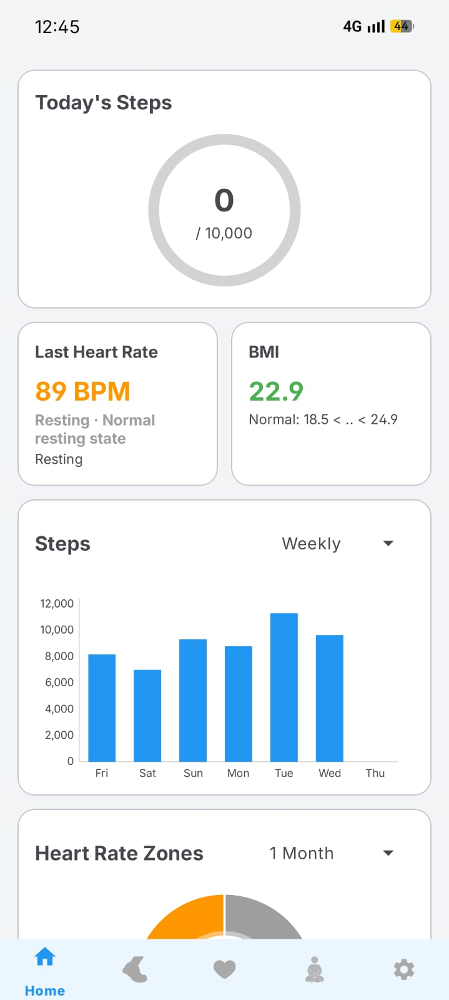 | 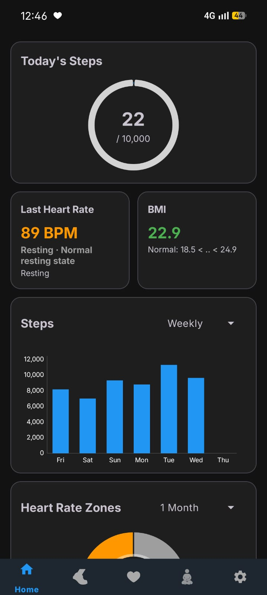 | 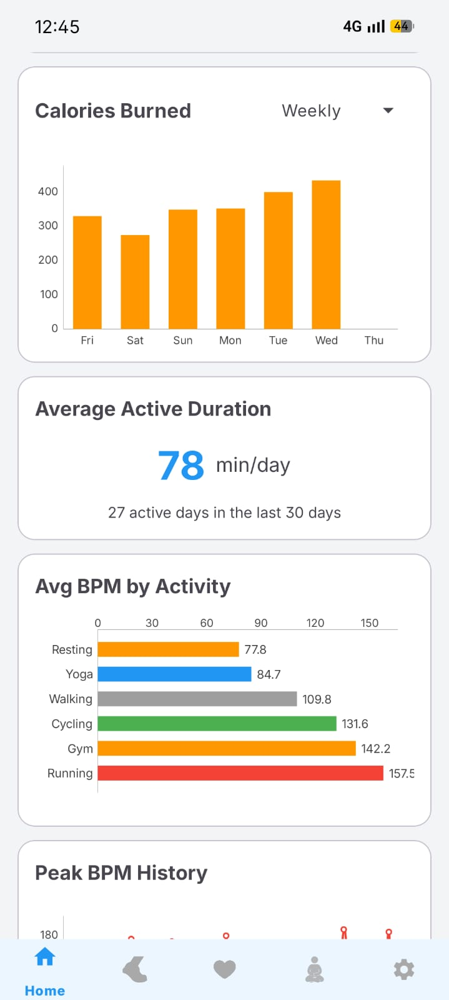 | 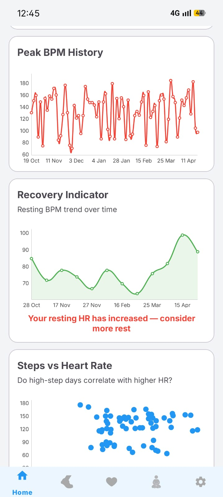 | 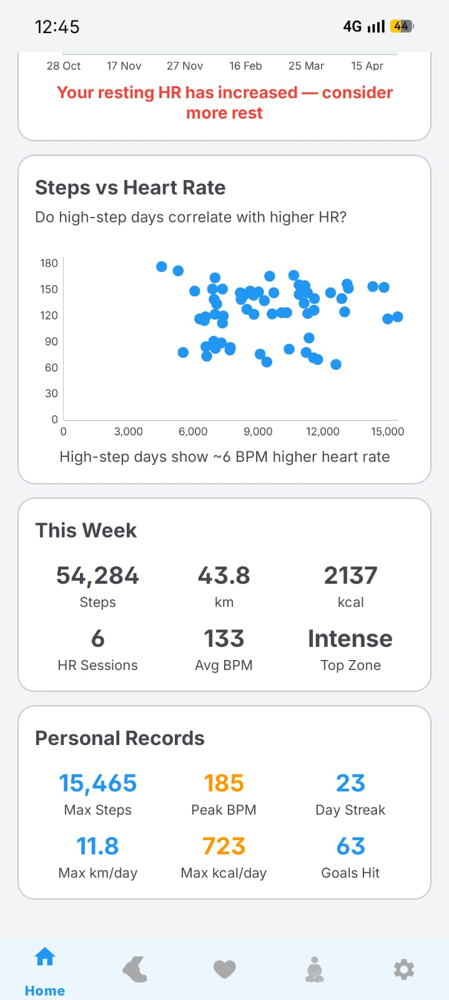 |

### Pedometer

| Light | Dark |
|:-----:|:----:|
| 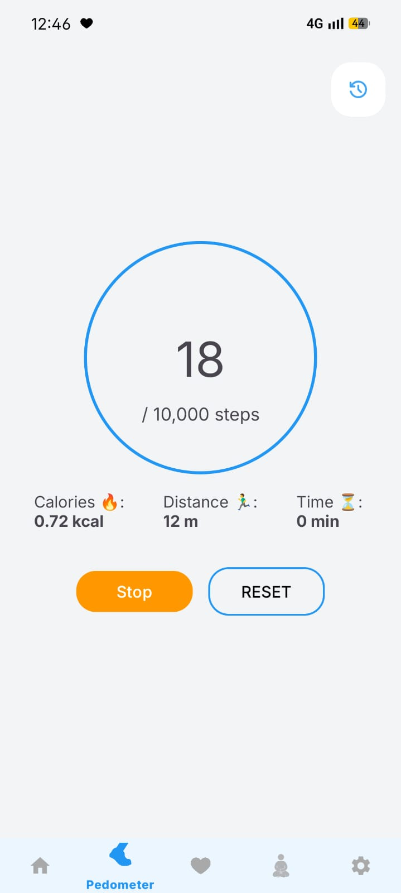 | 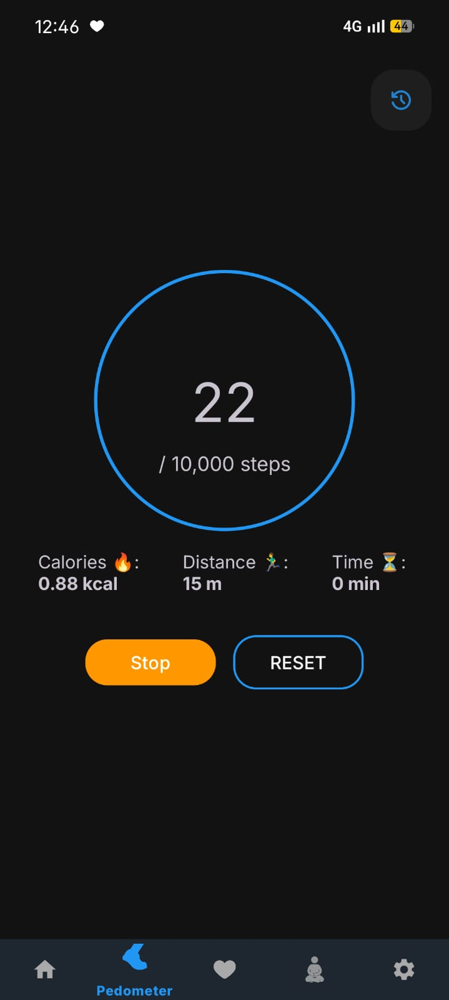 |

### Heart Rate

| Light |
|:-----:|
| 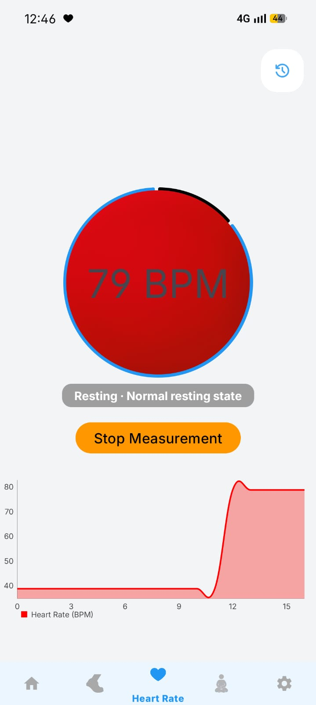 |

### Meditation

| Light | Box Breathing |
|:-----:|:-------------:|
| 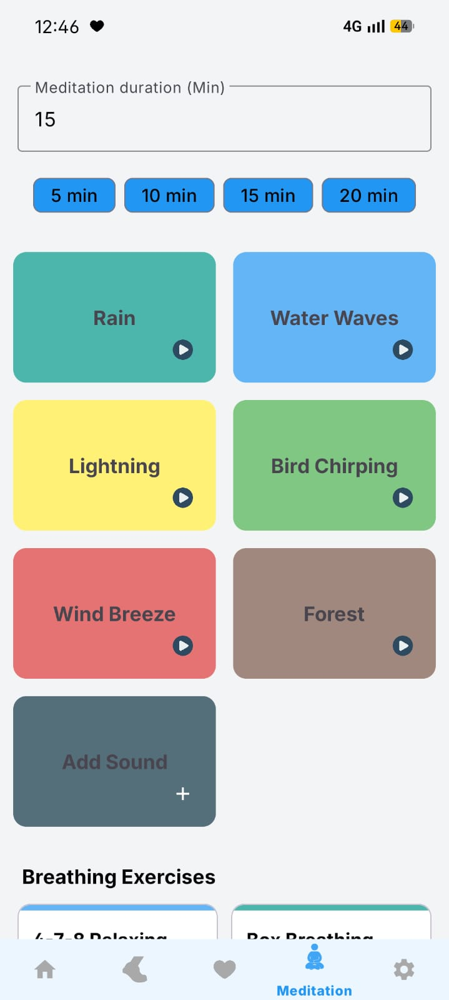 | 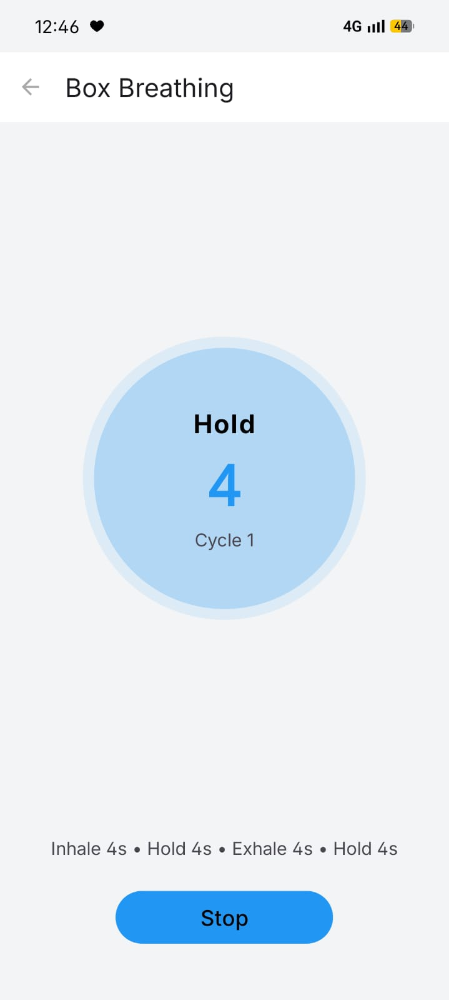 |

### Settings

| Light | Dark |
|:-----:|:----:|
| 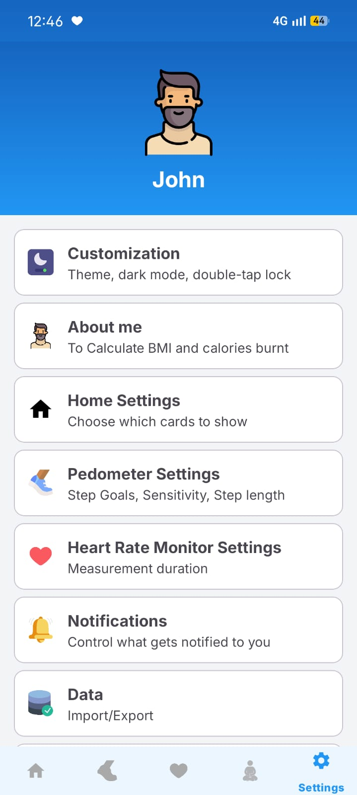 | 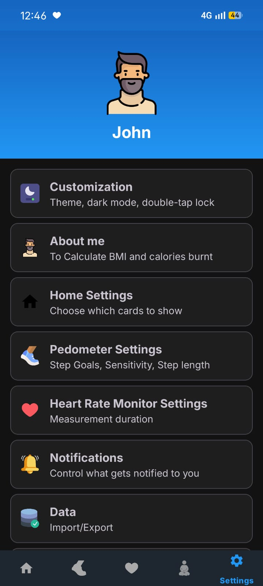 |

## Privacy first

**Your health data stays on your device.**

- All data is stored locally using an embedded on-device database ([PaperDB](https://github.com/pilgr/Paper))
- No accounts. No login. No cloud sync.
- Camera is used only to measure heart rate — no frames are recorded or stored
- Step and heart rate data is stored only in your device's internal storage
- No ad SDKs, no analytics, no crash reporting
- No `INTERNET` permission — the app is technically incapable of making network calls

The only time health data moves is when *you* explicitly export it via the in-app backup feature, which saves a JSON file to a location you choose on your own device.

See [PRIVACY.md](PRIVACY.md) for the full privacy policy.

## Features

### Pedometer
Counts steps using the device's built-in step counter sensor. Runs as a foreground service so it keeps counting while your phone is in your pocket.

- Real-time step, distance, calorie, and duration tracking
- Configurable daily step goal
- Adjustable sensor sensitivity (Low / Medium / High / Very High)
- Session history with per-session detail view
- BMI display calculated from your personal information

### Heart Rate Monitor
Measures heart rate using the camera. Place your finger over the lens — the app analyzes subtle changes in the red channel to detect your pulse.

- Real-time BPM display with a live chart
- Configurable measurement duration and sensitivity
- Saves measurements with activity context (Walking, Running, Cycling, Resting)
- Session history

### Meditation
Plays ambient nature sounds to help you focus or unwind.

- Six built-in soundscapes: Rain, Water Waves, Lightning, Bird Chirping, Wind Breeze, Forest
- Add your own sounds from device storage
- Selectable session duration (5 / 10 / 15 / 20 min, or custom)
- Runs as a foreground service for uninterrupted playback
- Rotating motivational quotes

### Data Backup
Export all your health data to a JSON file and import it back at any time.

- Uses Android's Storage Access Framework — no storage permissions required
- You choose where to save the file
- All data (steps history, heart rate history, personal info, settings) is included

## Permissions

| Permission | Reason |
|---|---|
| `ACTIVITY_RECOGNITION` | Step counting |
| `CAMERA` | Heart rate measurement |
| `POST_NOTIFICATIONS` | Foreground service notifications |
| `FOREGROUND_SERVICE` | Background step tracking and meditation audio |
| `READ_MEDIA_AUDIO` | Pick custom meditation sounds from device storage (API 33+) |

## Tech stack

- Kotlin, Android SDK (min API 24, target API 35)
- Dagger Hilt for dependency injection
- PaperDB for local storage
- ExoPlayer / Media3 for audio playback
- CameraX for heart rate analysis
- Kotlin Coroutines + StateFlow
- MPAndroidChart for BPM graph

## Building

```bash
# Debug build
./gradlew assembleDebug

# Release build (requires signing keys in local.properties — see local.properties.example)
./gradlew assembleRelease
```

Output APKs are named `Sehat_<version>_<buildType>.apk`.

Requires Android Studio Hedgehog or later.

---

## License

MIT — see [LICENSE](LICENSE).

## Privacy

See [PRIVACY.md](PRIVACY.md).
